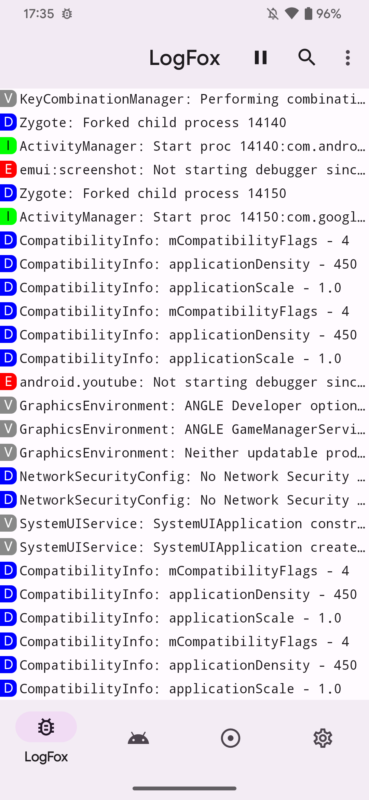
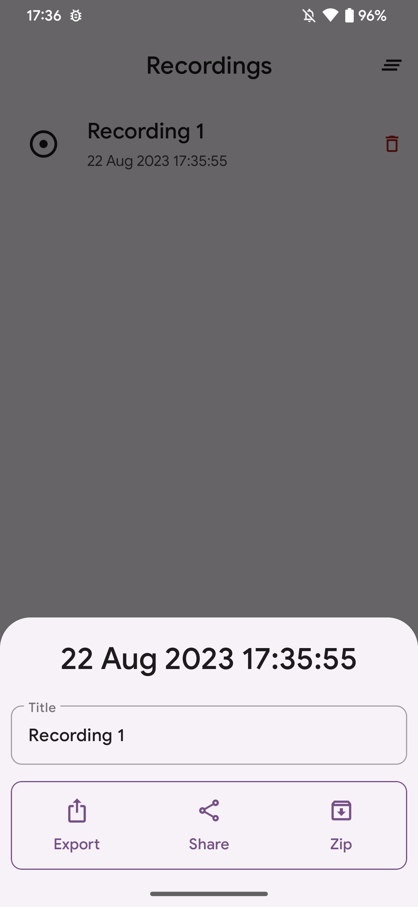
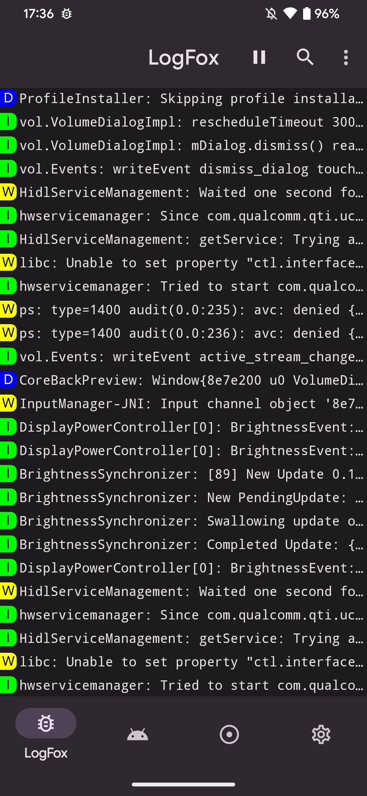

# LogFox


Yet another LogCat reader for Android

[](./LICENSE)
[](https://github.com/F0x1d/LogFox/releases/latest)
[](https://github.com/F0x1d/LogFox/releases/latest)

## Status

I am no longer interested in this project, so I am stopping maintaining it

## Tech

I started it as a student interested in Android development. 
Now, as an accomplished and experienced engineer, I see that this project requires a complete refactoring.
Do not copy or reuse patterns used in LogFox

## Features

- [Shizuku](https://shizuku.rikka.app/), Root & ADB support
- Record logs and export to ZIP with device info
- Observe and get notifications about Java/JNI crashes and ANRs
- Powerful filters for logs
- Accessibility support
- Material You design

## Download

<a href="https://f-droid.org/packages/com.f0x1d.logfox">
    
</a>

## Screenshots

<p align="center">
  
  
  
  
  
</p>

## License

```txt
Copyright (C) 2022-2024 Maksim Zoteev

This program is free software: you can redistribute it and/or modify
it under the terms of the GNU General Public License as published by
the Free Software Foundation, either version 3 of the License, or
(at your option) any later version.

This program is distributed in the hope that it will be useful,
but WITHOUT ANY WARRANTY; without even the implied warranty of
MERCHANTABILITY or FITNESS FOR A PARTICULAR PURPOSE.  See the
GNU General Public License for more details.

You should have received a copy of the GNU General Public License
along with this program.  If not, see <https://www.gnu.org/licenses/>.
```
