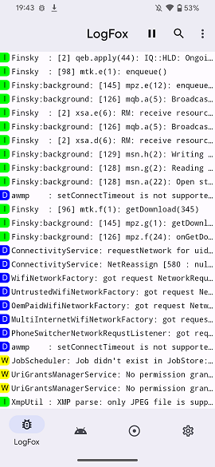
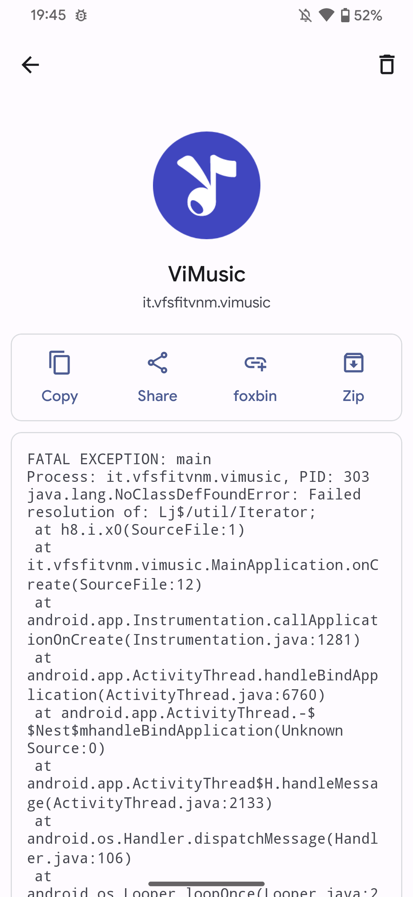
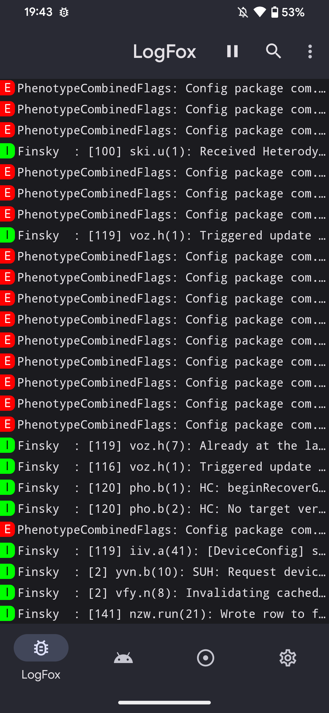

# LogFox


Yet another LogCat reader for Android

[](./LICENSE)

## Features

- [Shizuku](https://shizuku.rikka.app/) (No Root) & Root support
- Record log
- Show crashes
- Material You

## Download

<a href="https://f-droid.org/packages/com.f0x1d.logfox">
    
</a>

## Screenshots

<p align="center">
  
  
  
  
  
</p>

## License

```txt
Copyright (C) 2022-2023 Zoteev Maksim

This program is free software: you can redistribute it and/or modify
it under the terms of the GNU General Public License as published by
the Free Software Foundation, either version 3 of the License, or
(at your option) any later version.

This program is distributed in the hope that it will be useful,
but WITHOUT ANY WARRANTY; without even the implied warranty of
MERCHANTABILITY or FITNESS FOR A PARTICULAR PURPOSE.  See the
GNU General Public License for more details.

You should have received a copy of the GNU General Public License
along with this program.  If not, see <https://www.gnu.org/licenses/>.
```
